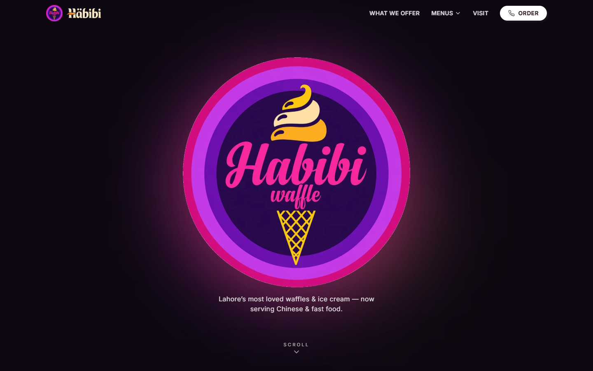

# Habibi Waffle

**[Live demo →](https://aayansheraz.github.io/habibi-waffle/)**



A scroll-driven story website for **Habibi Waffle**, Lahore — famous for waffles
& ice cream, and also serving Chinese and fast food.

Built with **React + Vite + TypeScript + Tailwind CSS + Framer Motion**, with
**React Router** for the per-category menu pages.

## Concept

1. **Logo intro** — the Habibi Waffle badge fills the screen.
2. **Scroll story** — scrolling drives a chapter-by-chapter story of what we
   serve: waffles & ice cream → Chinese → broast / pizza / wraps.
3. **Three-stripe poster** — the striped page with a button per food type.
4. Each stripe routes to its own **menu page** (`/menu/waffle`,
   `/menu/chinese`, `/menu/fastfood`) listing the products.

## Getting started

```bash
npm install      # first time only
npm run dev      # start dev server (hot reload)
```

Open the URL Vite prints (usually http://localhost:5173).

## Scripts

| Command           | What it does                         |
| ----------------- | ------------------------------------ |
| `npm run dev`     | Start the local dev server           |
| `npm run build`   | Type-check + production build         |
| `npm run preview` | Preview the production build locally |

## Structure

```
src/
├── App.tsx                 # routes
├── pages/
│   ├── Home.tsx            # intro + story + poster + footer
│   └── MenuPage.tsx        # per-category product page
├── components/
│   ├── ScrollStory.tsx     # scroll-driven logo intro + story chapters
│   ├── StripedPoster.tsx   # three clickable food stripes
│   ├── HabibiLogo.tsx      # SVG recreation of the circular logo
│   ├── BlurText.tsx        # word-by-word blur-in animation
│   ├── Navbar.tsx / Footer.tsx
│   └── icons.tsx
└── data/menu.ts            # categories + products (edit prices/items here)
```

## Customising

- **Products & prices:** edit `src/data/menu.ts`.
- **Brand colours:** `tailwind.config.js` under `theme.extend.colors.habibi`.
- **Real photos:** drop images into `public/images/` and reference them as
  `/images/your-file.jpg` in the components.

> Note: the logo is currently an SVG recreation. Swap in the real logo/photos
> when you have them.
